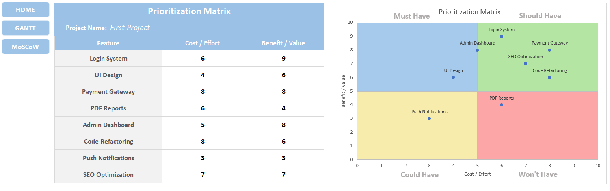
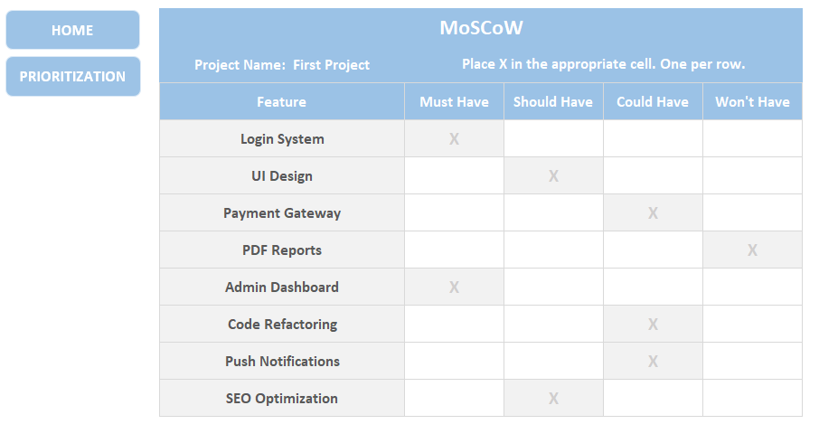
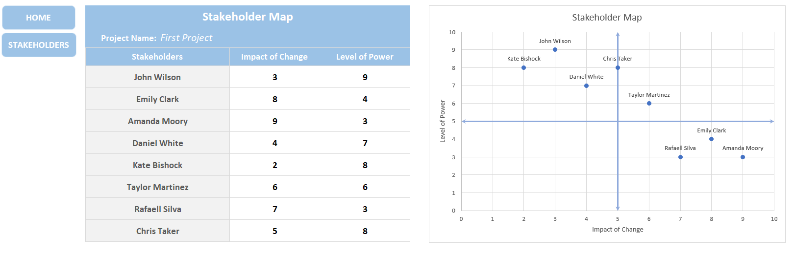

# Scrum Delivery Framework Template

**The Scrum Delivery Framework Template** is a high-performance management toolkit developed in Microsoft Excel. It is specifically engineered to support **Scrum Masters**, **Product Owners**, and **Project Managers** in bridging the gap between Agile flexibility and corporate reporting requirements.

By combining tactical Scrum elements with strategic project management tools, this framework serves as a "Single Source of Truth" for product delivery. Enhanced with **VBA (Visual Basic for Applications)**, the template offers an automated experience that reduces manual overhead and ensures data consistency across all modules.

---

## Key Modules (Sheets)

The framework is organized into four core functional areas designed to streamline the delivery lifecycle:

### 1. WBS (Work Breakdown Structure)
The architectural foundation of your product. This module allows for a hierarchical breakdown of the product scope, serving as the primary input for **Backlog grooming** and refinement sessions.

### 2. Gantt Chart
An automated, dynamic timeline for tracking **milestones, dependencies, and high-level roadmaps**. It translates iterative Sprint progress into a visual format easily understood by executive stakeholders.

### 3. Prioritization Matrix
A decision-making framework for **Features**. It allows the team to weigh the value of a feature against the effort required, ensuring the most impactful work is tackled first.

### 4. MoSCoW Analysis
A dedicated sheet for categorizing features into **Must have, Should have, Could have, and Won't have**. This provides clarity for the Product Owner when defining MVP (Minimum Viable Product) boundaries.

### 5. Stakeholder Engagement Assessment
A strategic matrix designed to analyze stakeholder **influence and interest**. This tool empowers the Product Owner to manage expectations, plan communications, and navigate organizational influence effectively.

### 6. Stakeholder Map
An advanced visualization tool focusing on the **"Level of Power"** and **"Impact of Change"**. This helps in identifying key players who require high-touch engagement during organizational transitions.

### 7. RACI - Resource Assignment Matrix
A governance module that defines **who does what** for each feature. It clarifies roles by assigning responsibility (Responsible, Accountable, Consulted, Informed), eliminating ambiguity in cross-functional teams.

### 8. Project Budget (Budget vs. Actual)
A rigorous financial tracking module. It compares **Planned Budget vs. Actual Expenses** in real-time, providing immediate visibility into variances and ensuring the project remains within its approved financial parameters.

---

## System Requirements

* **Software:** Microsoft Excel (2019 or newer / Microsoft 365 recommended).
* **Permissions:** Macros must be enabled (`.xlsm` format) to utilize the VBA automation features.
* **Platform:** Optimized for Windows (VBA functionality may vary on Excel for Web or Mobile).

---

---

---

---

---

---

---

---
